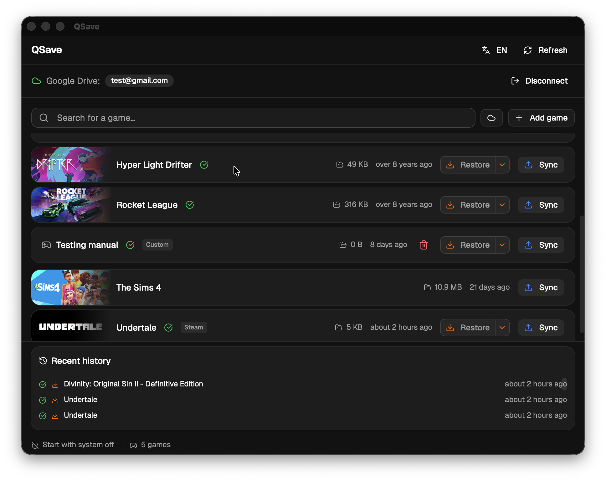
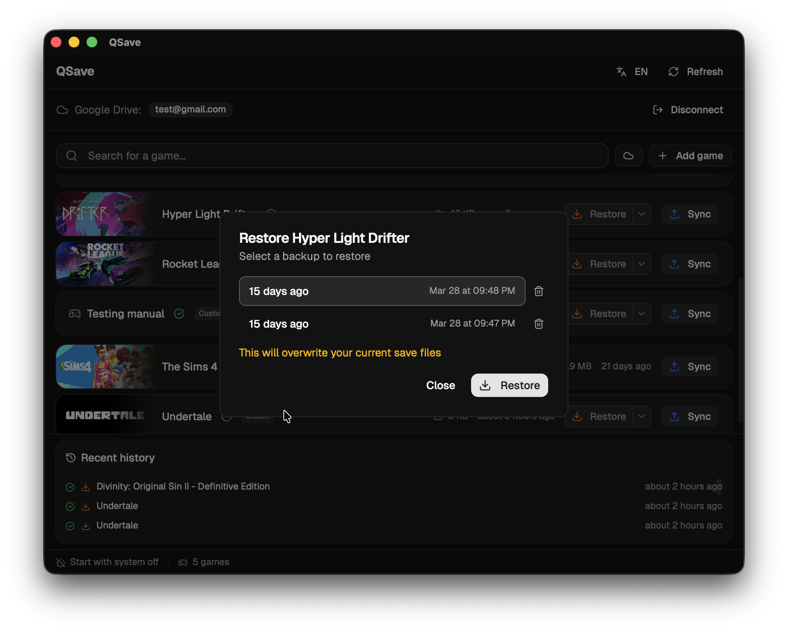
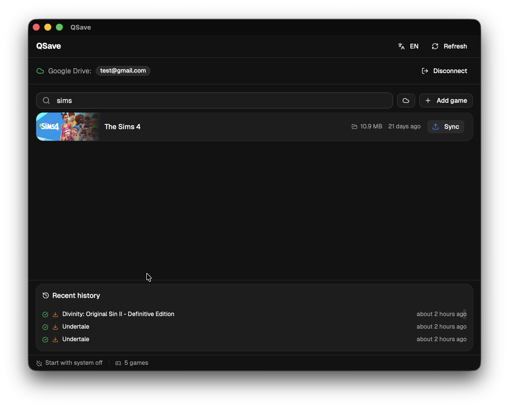
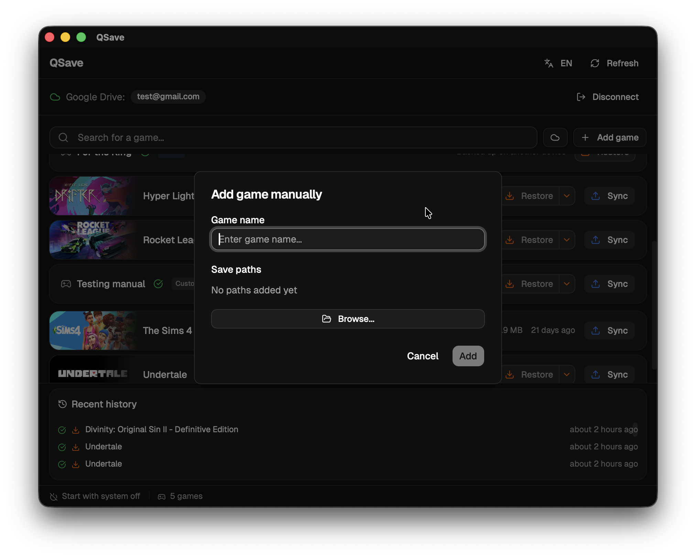

#  QSave

[](https://github.com/Tenrashi/qsave/blob/main/LICENSE) [](https://github.com/Tenrashi/qsave/releases) [](https://github.com/Tenrashi/qsave/actions)

Open-source desktop app that backs up your video game save files to Google Drive.

QSave detects installed games using the [Ludusavi](https://github.com/mtkennerly/ludusavi) manifest, and syncs your saves to Google Drive with built-in versioning. Restore them on any device — even across operating systems.

## Screenshots

|              Game library               |                 Version restore                 |
| :-------------------------------------: | :---------------------------------------------: |
|  |  |

|                 Search                 |                 Add manual game                  |
| :------------------------------------: | :----------------------------------------------: |
|  |  |

## Features

### Game Detection

- **19,000+ games** — Scans for save files using multiple community-maintained manifests covering Steam, GOG, Epic, Origin, Uplay, Battle.net, and standalone games
- **Store integration** — Detects Steam, GOG, and Epic Games Store installations to resolve save paths and match store-specific manifest conditions
- **Platform badges** — Shows which store each game belongs to (Steam, GOG, Epic)
- **Manual games** — Add any game with custom save paths for full coverage
- **Steam Cloud indicator** — Shows which games already have Steam Cloud saves, with a toggle to hide them
- **Instant launch** — Cached game list loads immediately while a fresh scan runs in the background

### Backup & Sync

- **Google Drive sync** — One-click upload of save files with automatic versioning
- **Streaming transfers** — Large saves are streamed and uploaded via resumable protocol, keeping memory usage low
- **Up to 5 backups per game** — Keep multiple versions of your saves
- **Change detection** — Fingerprint-based tracking skips uploads when saves haven't changed
- **Conflict detection** — Warns when local saves changed before restoring, or when another device uploaded a newer backup before syncing
- **Sync history** — See recent backup and restore operations with timestamps and status

### Restore

- **Quick restore** — One-click restore of the latest backup
- **Version picker** — Browse and restore from any of your saved versions
- **Cross-platform restore** — Backups use relative paths, so you can back up on one OS and restore on another
- **Cloud-only games** — See and restore games backed up from other devices, even if the game isn't installed locally
- **Custom restore location** — Pick any folder as the restore target
- **Backup deletion** — Remove individual backup versions from the cloud

### Desktop Integration

- **System tray** — Runs in the background; closing the window hides to tray
- **Autostart** — Optional launch at system startup
- **Native notifications** — OS notifications when sync or restore completes
- **Auto-updater** — In-app updates delivered automatically
- **Dark/Light mode** — Follows your system theme

### Internationalization

English, French, Spanish, German, Italian, Portuguese, Russian, Japanese, Chinese, Korean

## Tech Stack

- [Tauri 2](https://tauri.app/) — Desktop framework (Rust backend + web frontend)
- [React 19](https://react.dev/) + TypeScript
- [Tailwind CSS v4](https://tailwindcss.com/) + [shadcn/ui](https://ui.shadcn.com/)
- [TanStack Query](https://tanstack.com/query) + [Zustand](https://zustand.docs.pmnd.rs/)
- [Rayon](https://docs.rs/rayon/) — Parallel disk scanning in Rust

## Getting Started

### Prerequisites

- [Node.js 24](https://nodejs.org/) (LTS)
- [pnpm 10](https://pnpm.io/)
- [Rust](https://rustup.rs/) (stable)
- [Tauri 2 prerequisites](https://tauri.app/start/prerequisites/)

### Setup

```bash
cd qsave
pnpm install
```

Store secrets in your OS secret store (one-time setup):

**macOS (Keychain):**

```bash
security add-generic-password -a "$USER" -s "qsave-google-client-id" -w "YOUR_CLIENT_ID" -U
security add-generic-password -a "$USER" -s "qsave-google-client-secret" -w "YOUR_CLIENT_SECRET" -U
security add-generic-password -a "$USER" -s "qsave-tauri-signing-key" -w "YOUR_SIGNING_KEY" -U
security add-generic-password -a "$USER" -s "qsave-tauri-signing-key-path" -w "YOUR_KEY_PATH" -U
security add-generic-password -a "$USER" -s "qsave-tauri-signing-password" -w "YOUR_KEY_PASSWORD" -U
```

**Linux (libsecret):**

```bash
# Install: sudo apt install libsecret-tools
secret-tool store --label="qsave-google-client-id" service "qsave-google-client-id" <<< "YOUR_CLIENT_ID"
secret-tool store --label="qsave-google-client-secret" service "qsave-google-client-secret" <<< "YOUR_CLIENT_SECRET"
secret-tool store --label="qsave-tauri-signing-key" service "qsave-tauri-signing-key" <<< "YOUR_SIGNING_KEY"
secret-tool store --label="qsave-tauri-signing-key-path" service "qsave-tauri-signing-key-path" <<< "YOUR_KEY_PATH"
secret-tool store --label="qsave-tauri-signing-password" service "qsave-tauri-signing-password" <<< "YOUR_KEY_PASSWORD"
```

### Development

```bash
source scripts/load-env.sh && pnpm tauri dev
```

### Tests

```bash
pnpm test:run
```

### Build

```bash
pnpm tauri build
```

## Google Cloud Setup

1. Create a project in [Google Cloud Console](https://console.cloud.google.com/)
2. Enable the **Google Drive API**
3. Create **OAuth 2.0 credentials** (Desktop app type)
4. Configure the consent screen
5. Copy the client ID and secret to your `.env` file

## Release

Releases are automated with [semantic-release](https://github.com/semantic-release/semantic-release). Pushing to `main` triggers a stable release; pushing to `alpha` or `beta` creates a prerelease.

Versions are determined from [conventional commits](https://www.conventionalcommits.org/):

- `fix:` → patch bump (0.1.0 → 0.1.1)
- `feat:` → minor bump (0.1.0 → 0.2.0)
- `BREAKING CHANGE:` → major bump (0.1.0 → 1.0.0)

The CI pipeline bumps versions across `package.json`, `tauri.conf.json`, and `Cargo.toml`, generates a changelog, tags the release, and builds macOS (ARM + Intel) and Windows installers.

## Game Data

QSave uses the following manifests to detect games and their save file locations:

- [Ludusavi Manifest](https://github.com/mtkennerly/ludusavi-manifest) — primary game database, sourced from [PCGamingWiki](https://www.pcgamingwiki.com/)
- [Ludusavi Extra Manifests](https://github.com/BloodShed-Oni/ludusavi-extra-manifests) — community-contributed games missing from the primary manifest
- [Ludusavi Manifests (hvmzx)](https://github.com/hvmzx/ludusavi-manifests) — additional save paths for existing games

The primary manifest data comes from PCGamingWiki. If you find missing or incorrect save locations, please contribute back to the [wiki](https://www.pcgamingwiki.com/) so improvements benefit everyone.

## License

[AGPL-3.0](LICENSE)
